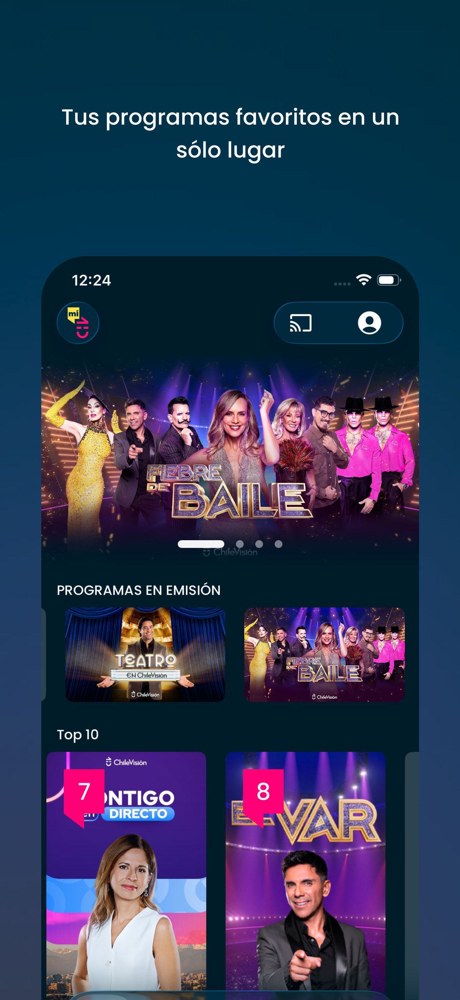
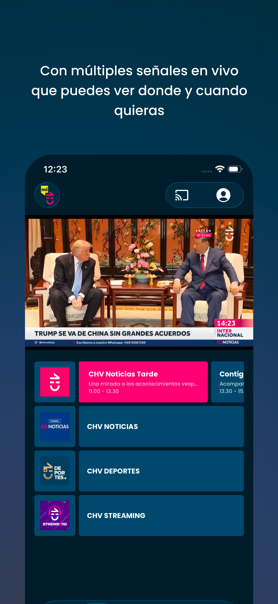
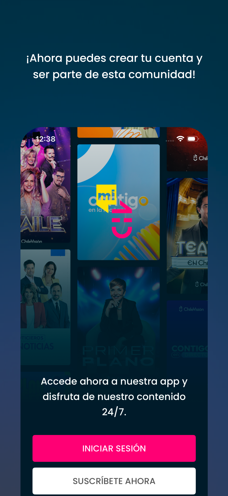
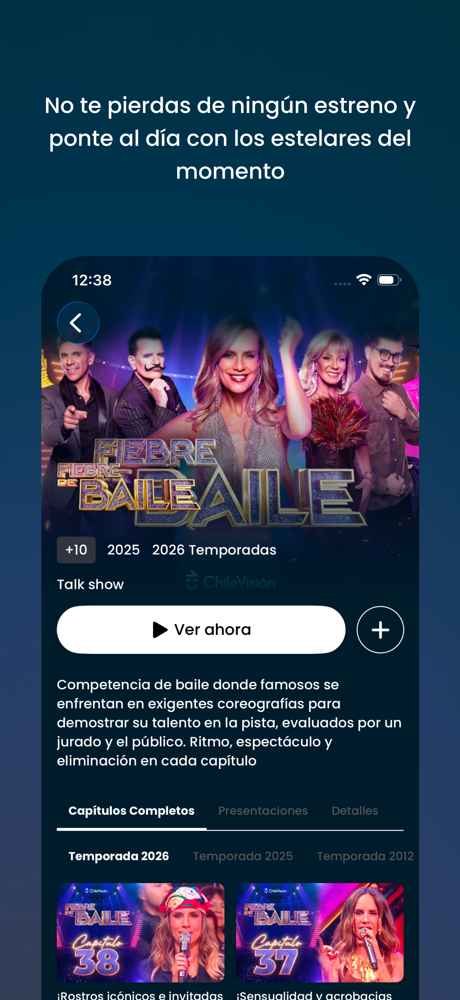
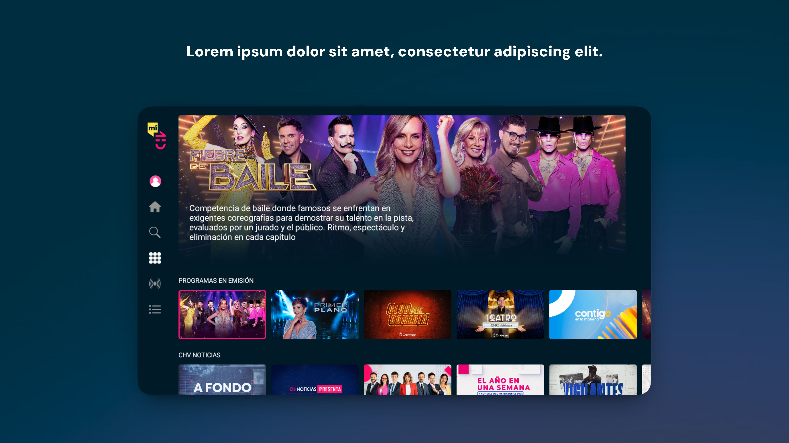
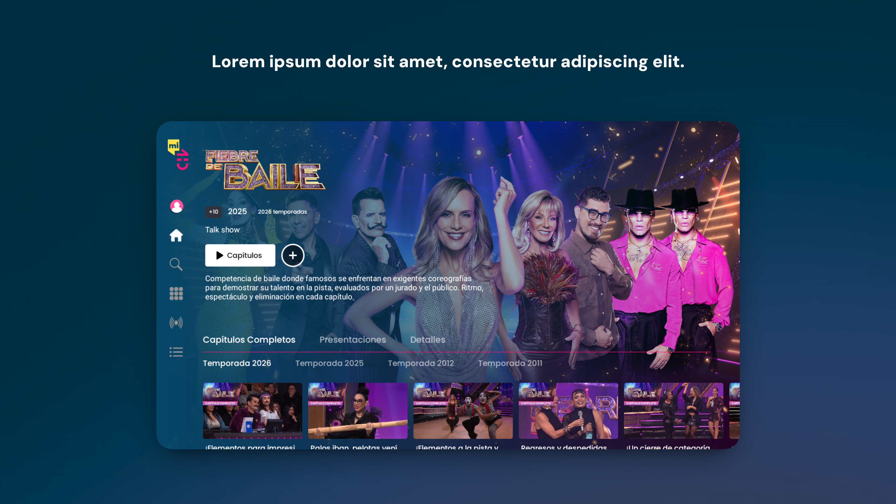

       
 
### 👋 Apasionado por las TIC. Soy una persona autodidacta y proactivo, que está en constante actualización sobre las ultimas tecnologías, especialmente en el mundo móvil.

## Aventon
Trabaje en el desarrollo y mantenimiento de las aplicaciones para clientes y conductores para ambos sistemas (Android/iOS). Usando lenguaje Kotlin y Swift se implementaron funcionalidades como visualización de conductores cercanos, la reserva y pago del servicio, además del seguimiento, comunicación vía chat y valoración del servicio.

**Tecnologías**
- 💾 Realm
- 🔥 Firebase
- 🗺️ Google Maps
- 🏛️ MVVM
- 📐 UIKit
- 🏎️ Swift
- 🤖 Kotlin
- 🔔 UserNotifications

## MiCHV

Trabajé en el desarrollo y mantenimiento de las aplicaciones móviles y TV de Chilevisión para Android, iOS, Android TV y tvOS. Usando Kotlin y Swift se implementaron funcionalidades como reproducción de señales en vivo, contenido a demanda (VOD), reproducción multimedia, navegación adaptada para TV, notificaciones y acceso mediante deep links.

También se trabajó en funcionalidades relacionadas con reproducción de video mediante Media3/ExoPlayer y AVPlayer, integración de publicidad con IMA Ads, Google Cast, Picture in Picture, selección de calidad de video y analíticas.

  
  
  
  
  
  

Tecnologías

* 🎬 Media3 / ExoPlayer
* ▶️ AVPlayer
* 📺 Android TV
* 🍎 tvOS
* 📢 IMA Ads
* 📡 Google Cast
* 🔥 Firebase
* 🏛️ MVVM
* 💉 Hilt
* 🎨 Jetpack Compose
* 🎨 SwiftUI
* 🤖 Kotlin
* 🏎️ Swift
* 🔔 UserNotifications
* 🔗 Deep Links
* 📊 Analytics
* 🖼️ Picture in Picture

## 13Go
Trabaje en el desarrollo y mantenimiento de las aplicaciones moviles y TV para el canal 13 de Chile. Usando lenguaje Kotlin y Swift se implementaron funcionalidades como listado de señales en vivo, contenido a demanda, reproducción de contenido multimedia y notificaciones.

**Tecnologías**
- 🎬 Media3 / ExoPlayer
- ▶️ AVPlayer
- 📺 Android TV
- 💾 Room
- 🔥 Firebase
- 🏛️ MVVM
- 💉 Hilt
- 🎨 Compose
- 🎨 SwiftUI
- 🤖 Kotlin
- 🏎️ Swift
- 🔔 UserNotifications

## Vive Health
Trabaje en el desarrollo y mantenimiento de las aplicaciones para clientes y profesionales de la salud en ambos sistemas (Android/iOS). Usando lenguaje Kotlin y Swift se implementaron funcionalidades como búsqueda de especialista, visualización de disponibilidad y reserva de la consulta. Se implementó la funcionalidad de videollamada para la teleconsulta y generación de la ficha clínica.

**Tecnologías**
- 💾 Room
- 🔥 Firebase
- 📲 Twilio
- 💳 Stripe
- 🏛️ MVVM
- 💉 Hilt
- 📐 UIKit
- 🏎️ Swift
- 🤖 Kotlin
- 🔔 UserNotifications

## Bi Banking
Trabaje en el desarrollo y mantenimiento de la aplicación Android para clientes empresariales de Banco Industrial. Usando lenguaje Kotlin y la herramienta Compose para la creación de interfaz de usuario nativa. Se implementaron funcionalidades para manejo de cuentas, pagos y transferencias siguiendo estándares de seguridad propia de una aplicación de banca.

**Tecnologías**
- 💾 Room
- 🔥 Firebase
- 🏛️ MVVM
- 💉 Hilt
- 🎨 Compose
- 🤖 Kotlin
- 🔔 UserNotifications
- 🔒 Themis

## Own. – Connect, Create, Trend
Aplicación desarrollada en lenguaje Swift y SwiftUI para la creación de interfaz de usuario nativa. Se implementaron funcionalidades como subscripciones mediante IAP, configuración remota, almacenamiento local, conexión Bluetooth entre dispositivos y notificaciones.

**Tecnologías**
- 💾 SQLite
- 🔥 Firebase
- 🎨 SwiftUI
- 🏎️ Swift
- 🧵 async/await
- 🔔 UserNotifications
- 💰 IAP

